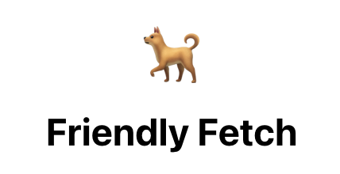
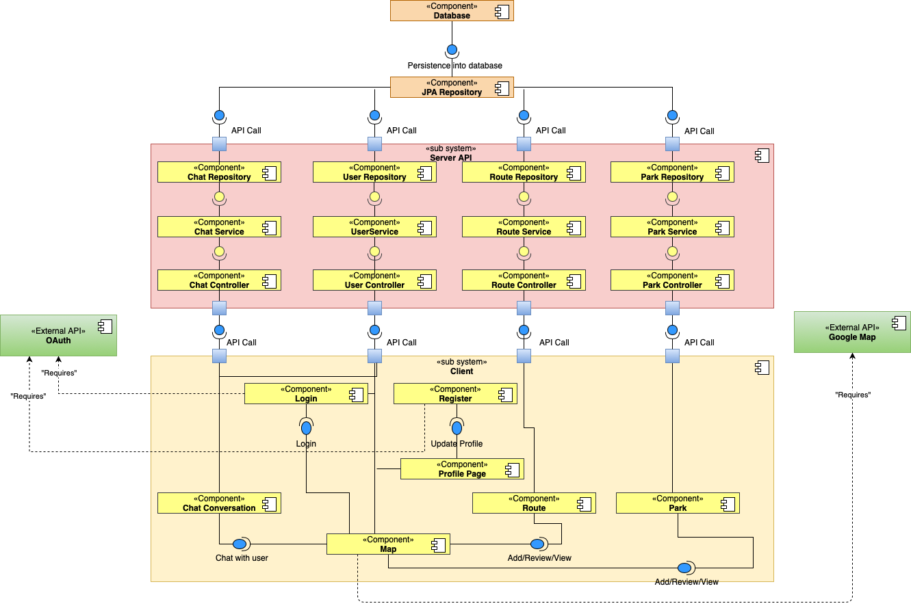
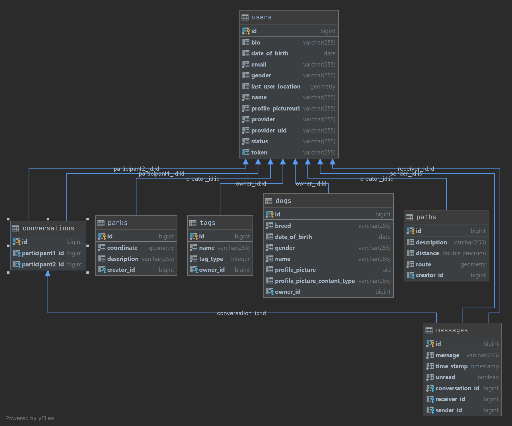

# FriendlyFetch — Server Application

Software Praktikum FS 2021 — Group 2

## Project Overview
FriendlyFetch is a community app for dog owners. It allows them to find and talk to other dog owners nearby, share information about dog-friendly parks and walking routes on a map, and indicate what they are looking for from others or have to offer to the community.
## Technologies
* Gradle  
  Project build and packaging is based on standard gradle tasks. A list of the most useful ones can be found [here](#build-commands).
* OpenAPI  
  The project is developed based on "API-first" approach, where any API modifications, have to be done in the [openapi.yaml](https://github.com/sopra-fs21-group-02/server/blob/master/api/openapi.yaml) first. After creating or modifying an API, a front-end and back-end client code must be regenerated and then actual implementation could follow. More info related to the OpenAPI specification can be found [OpenAPI-Spec](https://openapis.org). The underlying library integrating OpenAPI to SpringBoot is [springfox](https://github.com/springfox/springfox) . You can view the api documentation in swagger-ui by pointing to `http://localhost:8080/`. Further instructions how to generate client code, are listed [here](#build-commands).
* Spring Boot  
  Spring Boot is a rapid development framework that provides generic functionalities and utilities to develop a web-based application, without much effort. Important Spring Boot extensions, that have been used in this project are Spring Security and Spring Data JPA.
* JPA  
  Java Persistency API is an object relational mapping standard. In this project is we use Hibernate as JPA provider.
* GIS  
  This application is a type of Geographic Information System (GIS) and it collects spatial data. In order to persist and query spatial data, we have introduced DB spatial extensions H2GIS and PostGis, for H2 and Postgres DB respectively.
* Postgres and H2 DB  
  For development purposes, we are using H2 in-memory database. For production purposes, Postgres with Postgis extension is used.
* JWT/Google Identity Provider  
  As part of the user registration flow, we have introduced Spring OAuth2 security extension, to retrieve user registration details from Google Identity Provider. Authentication is implemented based on JSON Web Token.
* Github workflow actions  
  We have specified the following two action flows: [deploy.yml](https://github.com/sopra-fs21-group-02/server/blob/master/.github/workflows/deploy.yml) and [pr.yml](https://github.com/sopra-fs21-group-02/server/blob/master/.github/workflows/pr.yml). The first one is triggered automatically, once a pull request is merged into Master branch and deploys the backend application into a Heroku container. The second - runs automation testing, once a pull request is created.
* Lombok
  Is a set of libraries which generate and reduces the boiler-plate code, such as Getters, Setters, Hashcode and equals methods.
* MapStruct
  Is a library that generates Java objects mapper classes based on annotated interfaces.
* Heroku
  Heroku is a cloud platform, that is used for productive deployments. The Heroku backend project is `sopra-fs21-group-02-server` and the default URL is https://sopra-fs21-group-02-server.herokuapp.com/.
## Important build commands
* Project build
  `gradlew build`
* Generate Spring REST API sources
  `gradlew generateSpringSources`
* Generate and publish front-end/JavaScript client package
    1. Increment the openapi.yml version
    2. `gradlew generateClientSources`
    3. To publish the newly generated NPM package:
        * Go to `<project_root_dir>/build/generated/client`
        * In package.json change the "name" attribute to "sopra-fs21-group-02-dogs-api".
        * In the same directory run `npm install`
        * `npm login`
        * `npm publish . --access public`
* Project run
  `gradlew bootRun` with optional Spring `dev` profile, which will disable the original authentication mechanism and allow a developer to fake an authentication by providing an email into the `Authorisation` HTTP header. For more details, check the [JwtTokenAuthenticationFilter](https://github.com/sopra-fs21-group-02/server/blob/master/src/main/java/ch/uzh/ifi/hase/soprafs21/security/JwtTokenAuthenticationFilter.java).
* Tests execution
  `gradlew test`
## Components
Diagram bellow shows the main application components.

## Data model

## Code quality
For code analysis and quality metrics we have a SonarQube project (https://sonarcloud.io/dashboard?id=sopra-fs21-group-02_server).
## Deployment
We follow continuous deployment methodology. On each merge into Master branch, a new production deployment is triggered automatically. The deployment Github descriptor is  [deploy.yml](https://github.com/sopra-fs21-group-02/server/blob/master/.github/workflows/deploy.yml)
## Roadmap
* User should be able to search for other users based on his/her interests specified in "Looking for"/"Offering" section.
* User should be able to rate/give reviews to the parks and paths on the map.
* User should be able to filter displayed paths, parks or other users on the map via the filters (for example, by distance).
## Authors and Acknowledgement
FriendlyFetch was developed during the course "Software Praktikum" in the spring semester 2021 at Unviersity of Zurich by Ksenia Beloturkina, Céline Salzmann, Benjamin Schneider (Team Lead) and Neha Singh.

We'd also like to think our TA Alain Küng and the other groups who have provided feedback during milestone presentations and the beta testing phase.
## License
This project is licensed under the MIT License - see the [LICENSE.md](./LICENSE.md) file for details.
